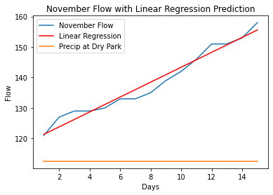

### Claire Acke
### Forecast 12 
### HWRS501

### Grade
3/3: Wow great work! Great job for figuring out linear regression and for figuring out how to get a different station. If its okay with you I think others would like to see both of these things in class tomorrow. 

**Forecast** 
For this week, my week 1 forecast is going to be 182.5, and my week 2 forecast is 200. These were made by doing a linear regression and taking the slope of this line. The slope was 2.45, so I projected that the flow would be increasing by 2.45 a day, therefore 17.15 a week. 

**1:** I chose to add mesonet data to supplement my forecast this week. I chose to use precipitation data, and narrowed it down to this month to see what's been going on. I used a station that is along the Verde River called Dry Park because I feel it could show at least part of the picture of our stream gauge. To access it, I followed a technique similar to what we did this week during class using a token and "creating" a url, downloading it directly into python. 

**Plot**

**2:**
Overall, I'm feeling okay about this unit. I feel like I understand the url input and can see the benefits of using this over just downloading the data. I am also proud of myself for figuring out how to use the linear regression within my forecast because it was difficult. 